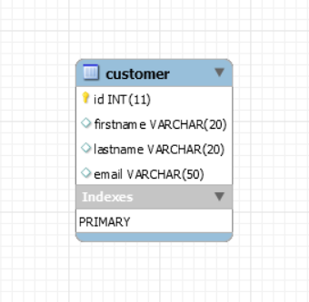

# CRM - Customer Relationship Management :computer:
CRM is a Java based Web Application used to manage customer record for a specific organization.

## Features :fire:
* Create new customer
* Delete customer
* Update Customer
* View all customer
* Login
* Logout

## Database Structure :file_folder:

## Technology Used :globe_with_meridians:
* Spring Boot
* Spring-MVC
* Spring Security
* MySQL
* HTML
* CSS

## Tools Used :wrench:
* IntelliJ IDEA
* Github
* Maven

## About the Developer
Connect me on LinkedIn [here](https://www.linkedin.com/mwlite/in/abhishek-vaish) :heart:
